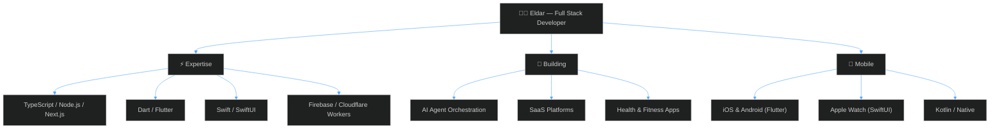

<!-- Animated header -->

 

<!-- Badges row -->

---

<!-- About Me mermaid diagram -->

---

### Tech Stack

 

---

### Featured Project

<table align="center">
<tr>
<td width="600">

  

**[CadForge](https://github.com/Ellweb3/cadforge)** — Modular CAD framework built on FreeCAD with AI integration

- Headless builds via FreeCADCmd subprocess
- React + three.js browser viewer with hot reload
- Sun simulation with NOAA solar positioning + real-time shadows
- Fly mode (WASD), layer groups, object picking
- Texture support with automatic UV mapping
- MCP server for AI-driven CAD automation
- Python modules → STL → glTF/GLB pipeline

  

</td>
</tr>
</table>

---

### GitHub Stats

 

 

<!-- Activity graph -->

---

<!-- Snake animation -->
<picture>
  <source media="(prefers-color-scheme: dark)" srcset="https://raw.githubusercontent.com/Ellweb3/Ellweb3/output/github-snake-dark.svg" />
  <source media="(prefers-color-scheme: light)" srcset="https://raw.githubusercontent.com/Ellweb3/Ellweb3/output/github-snake.svg" />
  
</picture>

---

 

